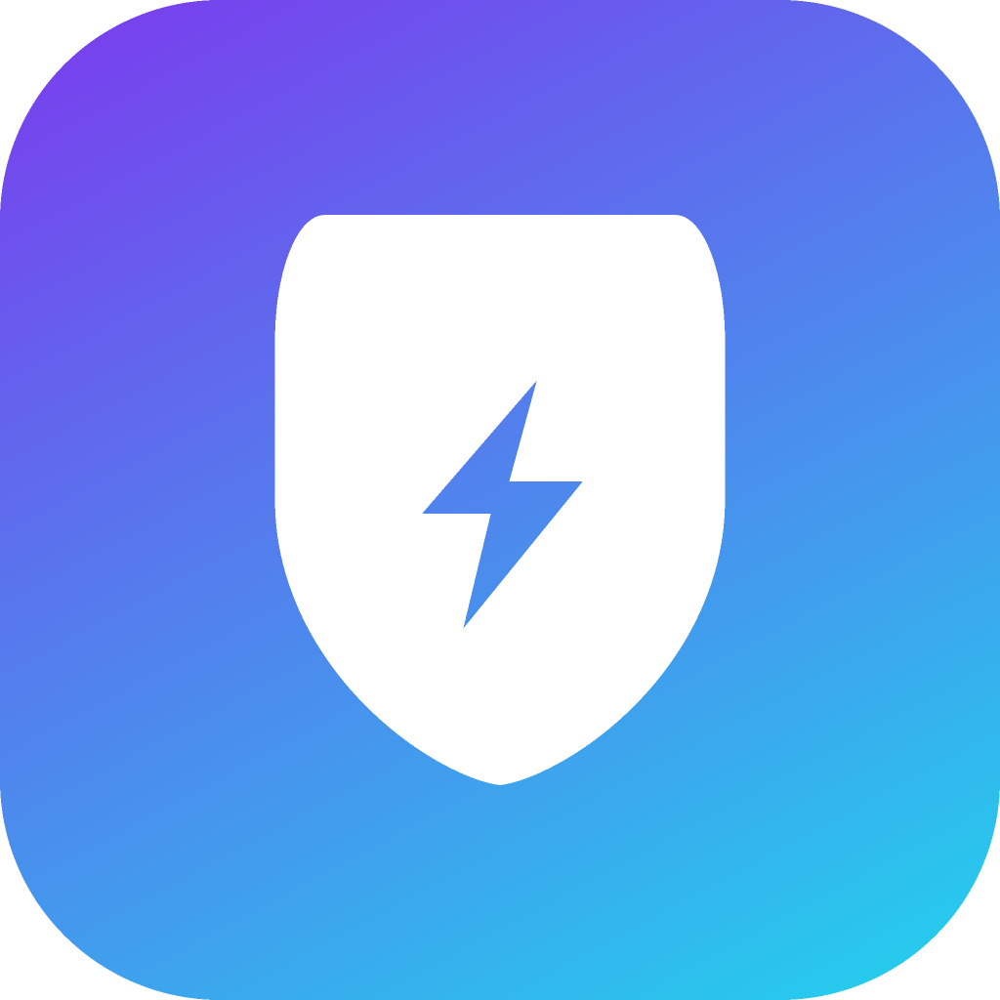
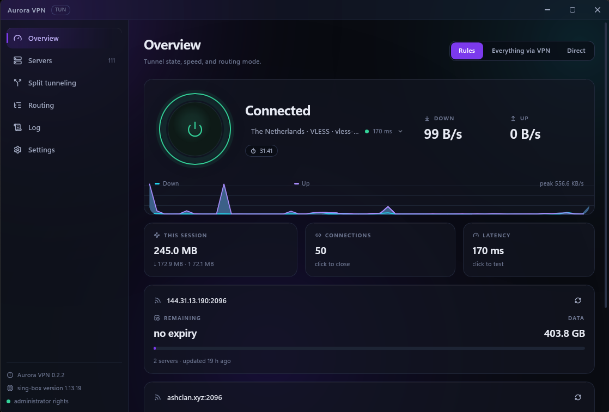
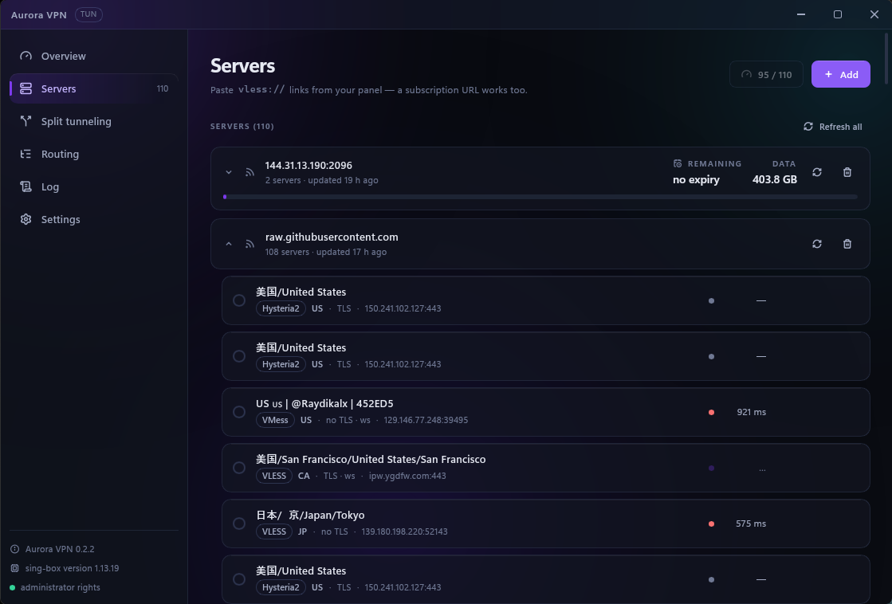
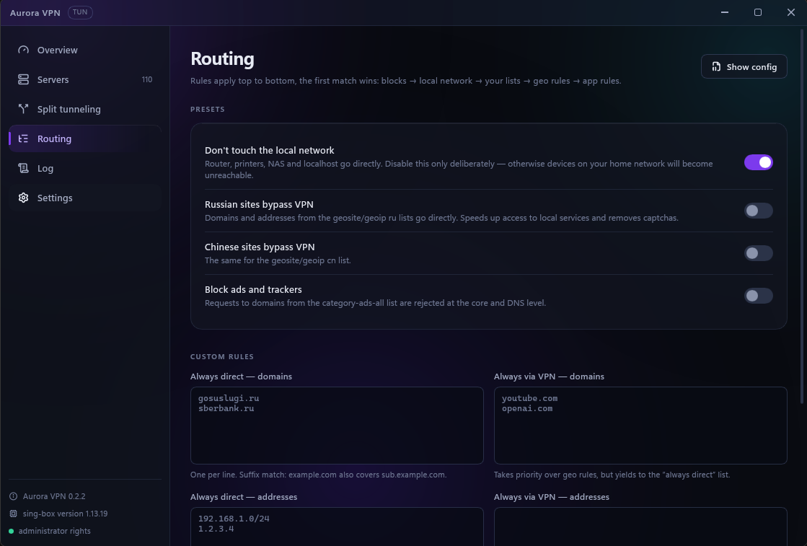
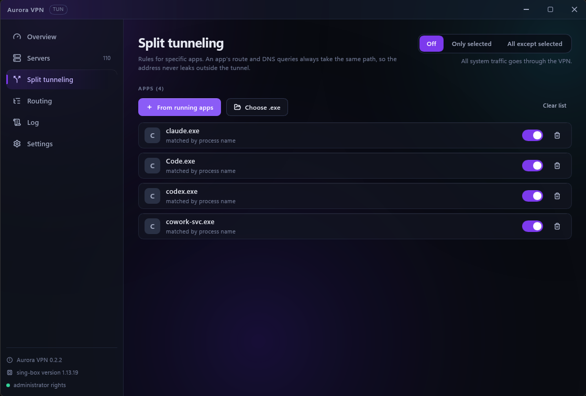
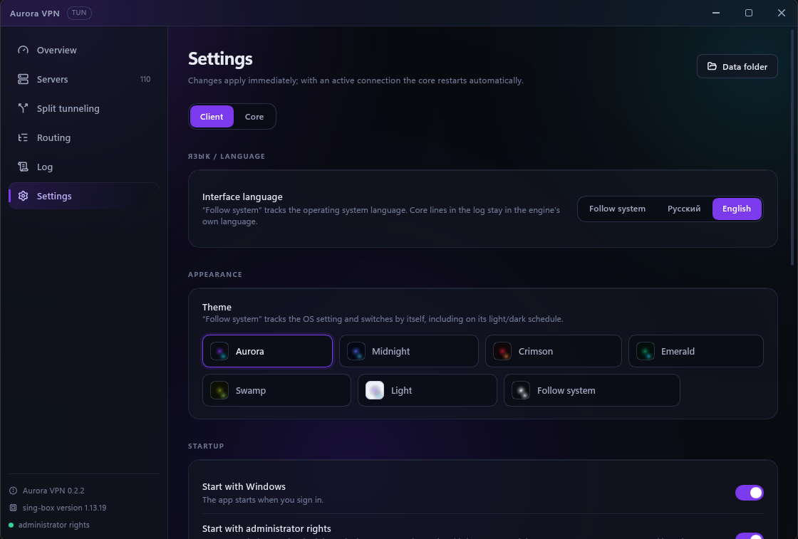

# Aurora VPN

**Cliente VPN de código aberto para VLESS, VMess, Trojan, Shadowsocks, Hysteria2 e TUIC.** 
Modo TUN, túnel dividido por aplicativo e roteamento por regras — no Windows, Android, Linux e macOS.

[English](README.md) · [Русский](README.ru.md) · [简体中文](README.zh-CN.md) · [日本語](README.ja.md) · [한국어](README.ko.md) · [العربية](README.ar.md) · **Português**

## Download

Todas as versões e seus checksums ficam na [página de releases](https://github.com/JustRin/aurora-vpn/releases/latest). No Windows, o aplicativo se atualiza sozinho a partir de lá.

<b>O Windows exibe “O Windows protegeu o seu computador”</b>

 

As versões ainda não têm assinatura de código, então o SmartScreen avisa sobre um editor desconhecido — trata-se da falta de assinatura, não da detecção de um malware. Clique em **Mais informações → Executar assim mesmo**.

O projeto enviou uma solicitação à [SignPath Foundation](https://signpath.org) (assinatura de código gratuita para código aberto); a CI já está preparada para assinar as versões assim que a solicitação for aprovada.

## Recursos

| | |
|---|---|
| **Protocolos** | VLESS, VMess, Trojan, Shadowsocks, Hysteria2, TUIC |
| **Segurança** | REALITY com impressões digitais uTLS, TLS, VLESS Encryption (ML-KEM-768) |
| **Transportes** | TCP, WebSocket, gRPC, HTTP/2, HTTPUpgrade, XHTTP |
| **Importação** | links `vless://` e afins, assinaturas 3x-ui / Marzban, atualização automática em segundo plano |
| **Status do plano** | dias e tráfego restantes, lidos direto do painel |
| **Modos de túnel** | TUN para todo o sistema, ou um proxy do sistema que dispensa direitos de administrador |
| **Túnel dividido** | por aplicativo — *apenas estes pela VPN* ou *todos, menos estes* |
| **Roteamento** | conjuntos de regras geográficas RU/CN, bloqueio de anúncios, suas próprias listas de domínios e sub-redes |
| **Troca** | servidor e o modo regras / tudo pela VPN mudam ao vivo, sem reiniciar o núcleo |
| **Início automático** | comum ou elevado pelo Agendador de Tarefas — sem prompt do UAC a cada logon |
| **Diagnóstico** | log ao vivo do núcleo, teste de latência, visualizador da configuração gerada |
| **Aparência** | 6 paletas mais *seguir o sistema*, vários idiomas de interface |

## Capturas de tela

| | |
|:--:|:--:|
|  **Servidores** |  **Roteamento** |
|  **Túnel dividido** |  **Configurações** |

## Primeiros passos

1. **Instale** a versão para o seu sistema e abra o aplicativo.
2. **Adicione servidores** — cole um link `vless://` / `vmess://` / … ou a URL de assinatura do seu painel. Tudo é importado de uma vez; links sem suporte são recusados com um motivo, em vez de falharem silenciosamente mais tarde.
3. **Conecte-se.** O modo TUN roteia todo o sistema e exige direitos de administrador — o aplicativo oferece reiniciar via UAC com um clique. O modo de proxy do sistema funciona sem eles.

## Documentação

- **[Como funciona](docs/architecture.md)** (em inglês) — a configuração de dois núcleos, a ordem das regras de roteamento, o túnel dividido e o DNS, o início automático, Android/libbox.
- **[Compilar a partir do código-fonte](docs/architecture.md#building-from-source)** (em inglês) — requisitos e comandos para cada plataforma.

<b>Alguma coisa não está funcionando</b>

 

**O núcleo morre logo após “Conectando…”** — abra o **Log**. A configuração é validada com `sing-box check` antes de iniciar, então a falha vem com um motivo concreto.

**Sem internet no modo TUN** — verifique se outro cliente não deixou um proxy do sistema para trás e tente desativar o *roteamento estrito* (ele entra em conflito com VirtualBox, WSL e alguns anticheats).

**Outro cliente VPN está em execução** — dois adaptadores TUN não convivem. O Hiddify e tudo o mais construído sobre o sing-box reivindicam o mesmo `172.19.0.1` e a mesma rota padrão; quem perde continua “conectado”, sem tráfego. Feche o outro cliente por completo — o adaptador dele vive enquanto o processo viver.

**Um site só falha dentro do túnel** — ative o Fake-IP ou adicione o domínio a *sempre direto*.

**A latência aparece como “n/a”** — com o núcleo desligado, ela mede um handshake TCP até o servidor, então “n/a” significa que a porta está inacessível. Já conectado, a sondagem passa pelo proxy e reflete a rota real.

**Sem status da assinatura** — o painel não enviou o cabeçalho `subscription-userinfo`. No 3x-ui ele existe apenas para assinaturas, nunca para servidores adicionados como link avulso.

## Construído sobre

[sing-box](https://github.com/SagerNet/sing-box) · [Xray-core](https://github.com/XTLS/Xray-core) · [Wintun](https://www.wintun.net/) · [Slint](https://slint.dev) · [Tauri](https://tauri.app)

## Licença

[MIT](LICENSE) © JustRin
